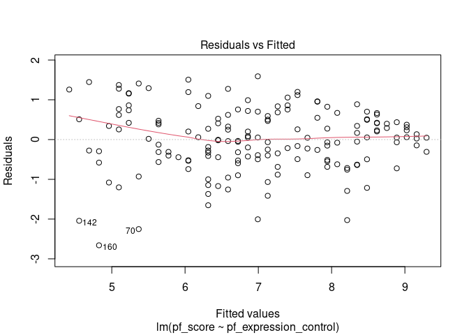
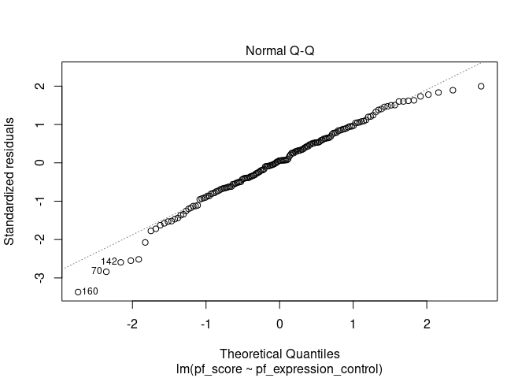
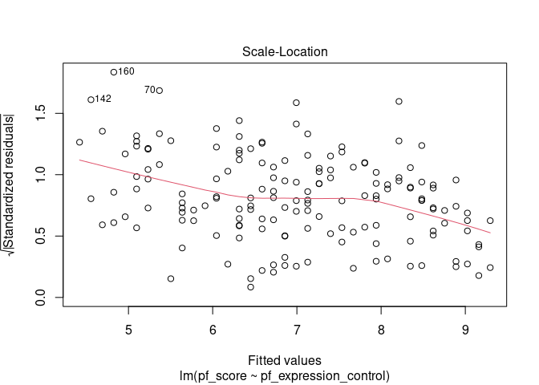
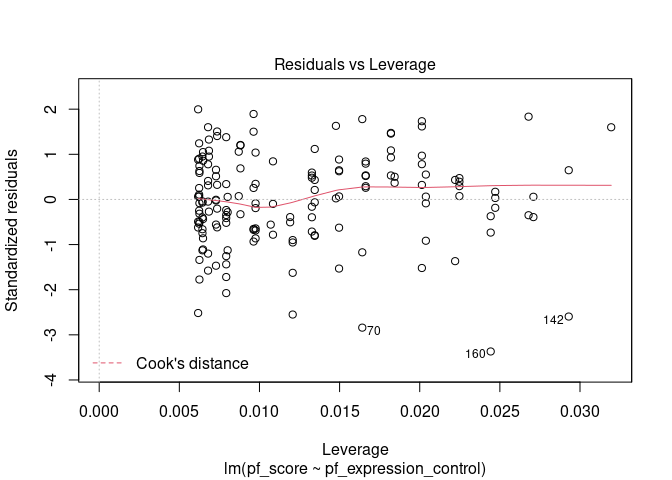

Activity 2: Simple Linear Regression
================
Debit Paudel
1/24/2023

``` r
library(tidyverse)
```

    ## ── Attaching packages ─────────────────────────────────────── tidyverse 1.3.2 ──
    ## ✔ ggplot2 3.3.6      ✔ purrr   0.3.4 
    ## ✔ tibble  3.1.8      ✔ dplyr   1.0.10
    ## ✔ tidyr   1.2.1      ✔ stringr 1.4.1 
    ## ✔ readr   2.1.3      ✔ forcats 0.5.2 
    ## ── Conflicts ────────────────────────────────────────── tidyverse_conflicts() ──
    ## ✖ dplyr::filter() masks stats::filter()
    ## ✖ dplyr::lag()    masks stats::lag()

``` r
library(tidymodels)
```

    ## ── Attaching packages ────────────────────────────────────── tidymodels 1.0.0 ──
    ## ✔ broom        1.0.1     ✔ rsample      1.1.0
    ## ✔ dials        1.0.0     ✔ tune         1.0.0
    ## ✔ infer        1.0.3     ✔ workflows    1.0.0
    ## ✔ modeldata    1.0.0     ✔ workflowsets 1.0.0
    ## ✔ parsnip      1.0.1     ✔ yardstick    1.0.0
    ## ✔ recipes      1.0.1     
    ## ── Conflicts ───────────────────────────────────────── tidymodels_conflicts() ──
    ## ✖ scales::discard() masks purrr::discard()
    ## ✖ dplyr::filter()   masks stats::filter()
    ## ✖ recipes::fixed()  masks stringr::fixed()
    ## ✖ dplyr::lag()      masks stats::lag()
    ## ✖ yardstick::spec() masks readr::spec()
    ## ✖ recipes::step()   masks stats::step()
    ## • Use tidymodels_prefer() to resolve common conflicts.

``` r
hfi <- readr::read_csv("https://www.openintro.org/data/csv/hfi.csv")
```

    ## Rows: 1458 Columns: 123
    ## ── Column specification ────────────────────────────────────────────────────────
    ## Delimiter: ","
    ## chr   (3): ISO_code, countries, region
    ## dbl (120): year, pf_rol_procedural, pf_rol_civil, pf_rol_criminal, pf_rol, p...
    ## 
    ## ℹ Use `spec()` to retrieve the full column specification for this data.
    ## ℹ Specify the column types or set `show_col_types = FALSE` to quiet this message.

``` r
hfi_2016 <- hfi %>% filter(year==2016)
hfi_2016 %>% select(pf_score, pf_expression_control)
```

    ## # A tibble: 162 × 2
    ##    pf_score pf_expression_control
    ##       <dbl>                 <dbl>
    ##  1     7.60                  5.25
    ##  2     5.28                  4   
    ##  3     6.11                  2.5 
    ##  4     8.10                  5.5 
    ##  5     6.91                  4.25
    ##  6     9.18                  7.75
    ##  7     9.25                  8   
    ##  8     5.68                  0.25
    ##  9     7.45                  7.25
    ## 10     6.14                  0.75
    ## # … with 152 more rows

## Simple Linear Regression

Below is a scatterplot of the two variables (note that the independent
is on the horizontal axis and the dependent is on the vertical axis).

``` r
library(ggplot2)

# Basic scatter plot with labels
scatplt <- ggplot(hfi_2016, aes(x=pf_expression_control, y=pf_score)) + geom_point(size=2, color="blue")
scatplt <- scatplt + ggtitle("The relationship between personal freedom score & expression control \n ") +
  xlab("Personal Freedom Expression Control") + ylab("Personal Freedom Score")

# Change the color, size and face of the title, x and y axis labels

scatplt <- scatplt + theme(
plot.title = element_text(color="red", size=14, 
                          face="bold.italic", hjust = 0.5),
axis.title.x = element_text(color="black", size=14, face="bold"),
axis.title.y = element_text(color="black", size=14, face="bold")
)

scatplt
```

<!-- -->

This data appears to follow a linear trend, and some R output for
placing a linear model on this scatterplot, using regression analysis,
is given below:

``` r
scatplt <- scatplt + geom_smooth(method=lm, se=FALSE, color="black")

scatplt
```

    ## `geom_smooth()` using formula 'y ~ x'

<!-- -->

At this point, we want to build the actual model and examine
characteristics that can be used to access the model. This can be
accomplished in R using the linear model command “lm”.

``` r
m1 <- lm(pf_score~pf_expression_control, data=hfi_2016)

#summary(m1)
tidy(m1)
```

    ## # A tibble: 2 × 5
    ##   term                  estimate std.error statistic  p.value
    ##   <chr>                    <dbl>     <dbl>     <dbl>    <dbl>
    ## 1 (Intercept)              4.28     0.149       28.8 4.23e-65
    ## 2 pf_expression_control    0.542    0.0271      20.0 2.31e-45

## Correlation Coefficients

``` r
cor(hfi_2016[,c("pf_expression_control","pf_score")], use="everything")
```

    ##                       pf_expression_control  pf_score
    ## pf_expression_control             1.0000000 0.8450646
    ## pf_score                          0.8450646 1.0000000

## Residual Analysis

``` r
library(lmtest, pos=4)
```

    ## Loading required package: zoo

    ## 
    ## Attaching package: 'zoo'

    ## The following objects are masked from 'package:base':
    ## 
    ##     as.Date, as.Date.numeric

``` r
bptest(pf_score ~ pf_expression_control, varformula = ~ fitted.values(m1), studentize=TRUE, data=hfi_2016)
```

    ## 
    ##  studentized Breusch-Pagan test
    ## 
    ## data:  pf_score ~ pf_expression_control
    ## BP = 14.675, df = 1, p-value = 0.0001277

``` r
plot(m1)
```

<!-- --><!-- --><!-- --><!-- -->

## Confidence Interval for the Slope:

``` r
confint(m1, level=0.95)
```

    ##                           2.5 %    97.5 %
    ## (Intercept)           3.9896039 4.5780268
    ## pf_expression_control 0.4883208 0.5953696
